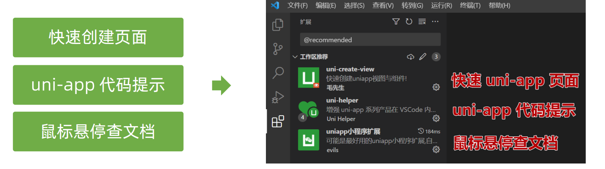
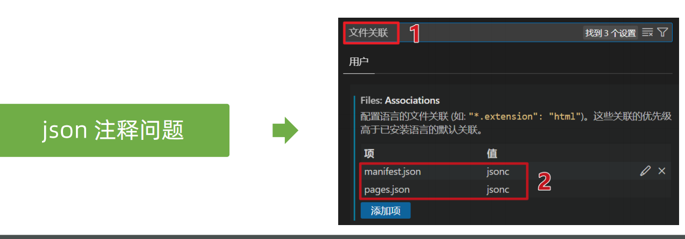
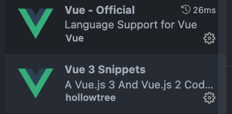

## uniApp + vue3 + ts + uni-ui + pinia(持久化) + vite + eslint + stylelint + commitlint + husky 小程序开发模板（uni-ui）可支持多端编译

### node 版本 v18+

### 基本使用 建议使用 pnpm

- 安装依赖

```javascript
pnpm install
```

- 启动

```
pnpm dev:mp-weixin
```

- 根据提示导入微信小程序开发工具

### 推荐使用 vscode，并且需要安装插件

- 安装插件






